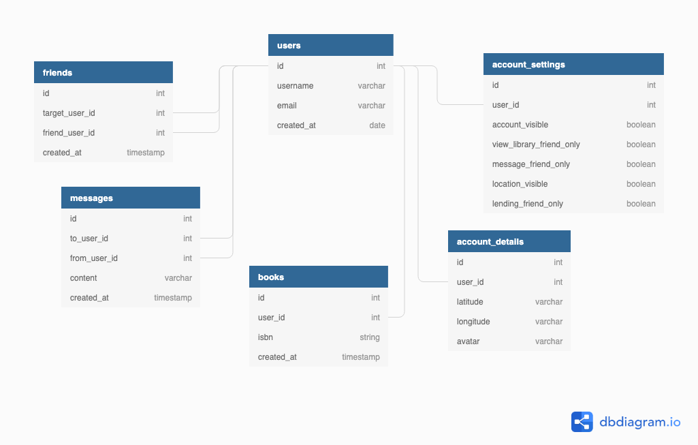

# API Documentation

#### Backend deployed at [TBD](url)

## Getting Started

## Framework

## Endpoints

| Method | Endpoint | Access Control | Description |
| ------ | -------- | -------------- | ----------- |


## Data Models



## Actions

## Environmental Variables

In order for the app to function correctly, the user must set up their own environment variables.
Create a .env file that includes the following:

```js
VARIABLE_NAME = 123456; // example value
```

## Contributing

If you have developed a patch, bug fix, or new feature that would improve this app, please submit a pull request. It is best to communicate your ideas with the developers first before investing a great deal of time into a pull request to ensure that it will mesh smoothly with the project.

Remember that this project is licensed under the MIT license, and by submitting a pull request, you agree that your work will be, too.
